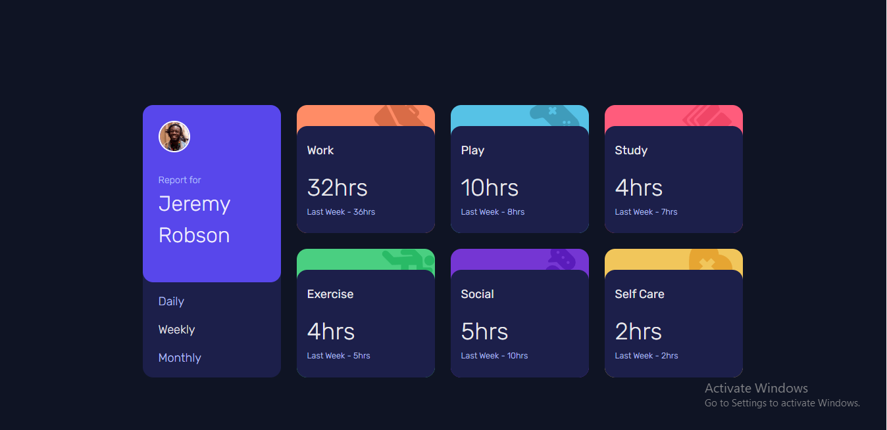

# Frontend Mentor - Time tracking dashboard solution

This is a solution to the [Time tracking dashboard challenge on Frontend Mentor](https://www.frontendmentor.io/challenges/time-tracking-dashboard-UIQ7167Jw). Frontend Mentor challenges help you improve your coding skills by building realistic projects.

## Table of contents

- [Overview](#overview)
  - [The challenge](#the-challenge)
  - [Screenshot](#screenshot)
  - [Links](#links)
- [My process](#my-process)
  - [Built with](#built-with)
  - [What I learned](#what-i-learned)
  - [Continued development](#continued-development)
  - [Useful resources](#useful-resources)
- [Author](#author)
- [Acknowledgments](#acknowledgments)

## Overview

### The challenge

Users should be able to:

- View the optimal layout for the site depending on their device's screen size
- See hover states for all interactive elements on the page
- Switch between viewing Daily, Weekly, and Monthly stats

### Screenshot

### Links

- Solution URL: [Add solution URL here](https://www.frontendmentor.io/solutions/time-tracking-dashboard-using-css-grid-and-js-wT7DEemhN_)
- Live Site URL: [Add live site URL here](https://master-shifu0.github.io/time-tracking-dashboard-FEM/)

## My process

- I wrote the HTML file first then i added styling to it with css and i used javascript to add behaviour to it

### Built with

- Semantic HTML5 markup
- Flexbox
- CSS Grid
- Mobile-first workflow
- Custom properties

### What I learned

I learned how to use json files to load data in html

### Continued development

I hope to continue bulding frontend projects for now and
very soon, i would start adding backend functionalities to my websites

## Author

- Frontend Mentor - [@yourusername](https://www.frontendmentor.io/profile/master-shifu0)
- Twitter - [@yourusername](https://www.twitter.com/omobabaijebu)

**Note: Delete this note and add/remove/edit lines above based on what links you'd like to share.**
